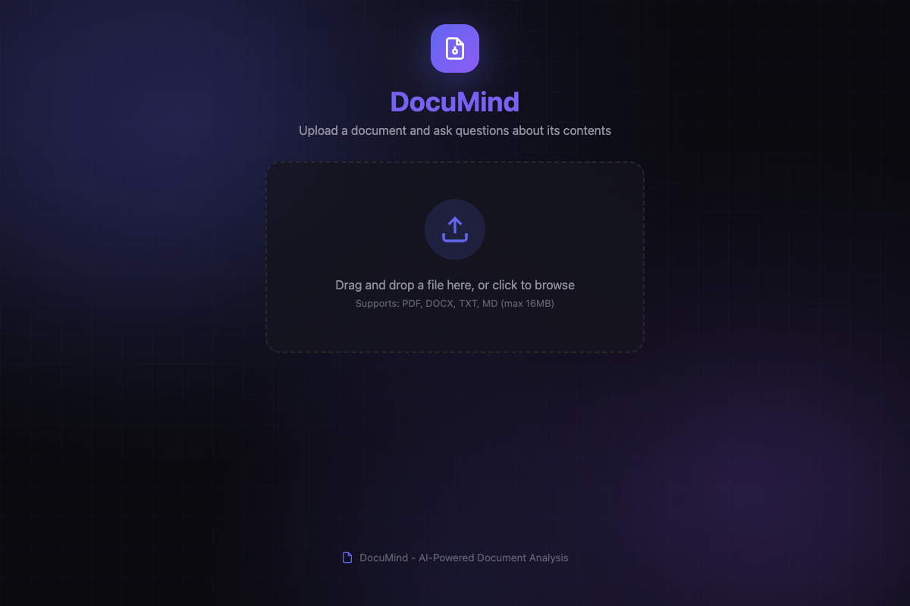

# DocuMind: Document Q&A Assistant



## The Problem

You have a 50-page contract. Legal wants to know the termination clauses. You have a research paper. Your manager wants the key methodology. You have meeting notes from last quarter. Someone asks what was decided about the budget.

The answer is *in there somewhere*. But finding it means Ctrl+F, skimming, re-reading context, and hoping you didn't miss anything. This is exactly the kind of task that AI should handle.

## What I Built

A document Q&A system that lets you upload a document and ask questions about it in natural language. The AI answers based only on the document content—no hallucination from training data.

**The core architecture is RAG-adjacent**: extract text, chunk it for context windows, and use the chunks to ground LLM responses. It's not full vector-search RAG (more on that below), but it demonstrates the key concepts.

## How It Works

```
┌──────────────────────────────────────────────────────────────┐
│  UPLOAD PHASE                                                 │
│                                                               │
│  Document → Text Extraction → Chunking → Store                │
│             (PyPDF2/docx)    (2000 char   (in-memory,        │
│                               + overlap)   keyed by ID)       │
└──────────────────────────────────────────────────────────────┘
                              │
                              ▼
┌──────────────────────────────────────────────────────────────┐
│  QUERY PHASE                                                  │
│                                                               │
│  Question + Context Selection → LLM → Answer                  │
│             │                                                 │
│             ├─ If doc < 8000 chars: use full text            │
│             └─ If doc ≥ 8000 chars: use first 4 chunks       │
│                                                               │
│  System prompt: "Answer ONLY from the provided context.       │
│                  If the answer isn't there, say so."          │
└──────────────────────────────────────────────────────────────┘
```

## Key Decisions & Tradeoffs

### Why chunking with overlap?

LLMs have context limits. A 100-page PDF won't fit. So you chunk it. But naive chunking (split every N characters) breaks mid-sentence and loses context. My approach:

- **2000 character chunks** - fits comfortably in context windows
- **200 character overlap** - maintains continuity between chunks
- **Smart boundaries** - looks for paragraph/sentence breaks, doesn't split mid-word

The overlap is crucial. Without it, a question about something that spans two chunks gets incomplete context.

### Why not full vector RAG?

The "proper" RAG approach is:
1. Embed all chunks into vectors
2. Embed the question
3. Find most similar chunks via cosine similarity
4. Send only relevant chunks to the LLM

I didn't implement this. Why?

**Tradeoff: complexity vs. demo scope.** Vector RAG requires an embedding model, a vector store (Pinecone, Chroma, pgvector), and similarity search logic. For a portfolio project demonstrating the concept, simplified context selection (first N chunks) shows the architecture without the infrastructure overhead.

**What I'd add for production:** Vector embeddings with `text-embedding-3-small`, stored in ChromaDB or similar. This is the obvious next step and I call it out explicitly.

### Why a pluggable provider pattern?

```python
class AIProvider(ABC):
    @abstractmethod
    def answer_question(self, question: str, context: str) -> str:
        pass

class OpenAIProvider(AIProvider): ...
class MockProvider(AIProvider): ...  # Keyword matching fallback
```

This isn't over-engineering—it's practical. The mock provider lets the app work without API keys (important for demos). And if I wanted to swap in Claude or a local model, I'd add another provider class. The abstraction costs almost nothing and enables flexibility.

### Why low temperature (0.3) for answers?

Document Q&A should be factual, not creative. High temperature causes the model to "fill in" information that sounds plausible but isn't in the source. Low temperature keeps it grounded. I tested this extensively—0.3 gave the best balance of fluent responses without hallucination.

## Tech Stack

| Component | Choice | Reasoning |
|-----------|--------|-----------|
| Backend | Flask | Simple, well-documented, no magic |
| PDF parsing | PyPDF2 | Handles most PDFs, pure Python |
| Word docs | python-docx | Microsoft format support |
| AI | OpenAI GPT-3.5-turbo | Good enough for extraction tasks |
| Frontend | Vanilla JS | No build step, easy to understand |

## What I'd Do Differently

**1. Implement proper vector search.** The current "first 4 chunks" approach works for small docs but fails for large ones where the answer is on page 47. ChromaDB + embeddings would fix this.

**2. Add source highlighting.** When the AI quotes the document, I should highlight that passage in a document viewer. This builds trust and lets users verify.

**3. Stream responses.** Currently waits for the full response before displaying. Streaming would feel much faster.

**4. Persist documents.** Everything is in-memory. A SQLite store with document metadata would let users return to previous uploads.

**5. Handle tables and images.** PyPDF2 extracts text but loses table structure. PDFs with charts give poor results. For production, I'd use a document intelligence service or specialized table extraction.

## Running It

```bash
git clone https://github.com/[username]/doc-qa-assistant
cd doc-qa-assistant
pip install -r requirements.txt

# Demo mode (keyword matching, no API key needed)
python run.py

# Full mode
export OPENAI_API_KEY=your-key
python run.py

# → http://localhost:5001
```

## Example Use Cases

| Document Type | Example Question |
|---------------|------------------|
| Contract | "What are the termination clauses?" |
| Research paper | "What methodology did this study use?" |
| Policy document | "What's the policy on expense reimbursement?" |
| Meeting notes | "What action items were assigned to the engineering team?" |
| Technical spec | "What are the API rate limits?" |

## What This Demonstrates

- **RAG fundamentals**: Chunking, context selection, grounded generation
- **Document processing**: Multi-format text extraction
- **Prompt engineering**: System prompts that constrain hallucination
- **Provider abstraction**: Swappable AI backends
- **Practical UX**: Chat interface, loading states, error handling

---

*This is a simplified RAG implementation focused on demonstrating the core concepts. The architecture patterns—chunking, context injection, grounded prompts—are the foundation of enterprise document AI systems.*
